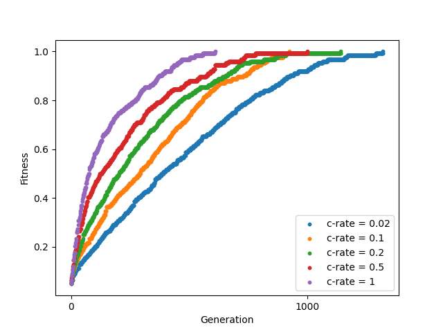
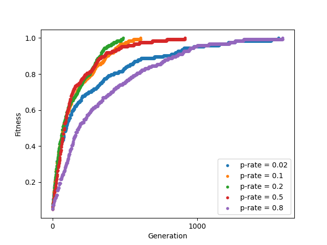
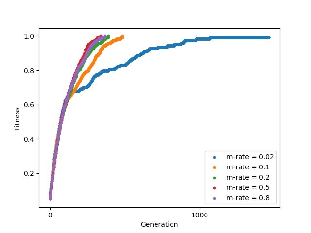

# evolpy: Evolutionary algorithm

Evolutionary algorithms uses mechanisms inspired by biological
evolution to find solutions to optimization problems.

## Implementation

Roughly, the algorithm works as follows:

1. Generate a list of random individuals (first generation)-
2. Evaluate the fitness of each individuum-
3. Selection : Select the fittest individuals (->parents)-
4. Recombination: Produce offsprings from parents viar crossover operations-
5. Mutation: Randomly mutate individual genes of some offsprings.
6. Replace some or all individuals with the new offspring individuals.

Repeat steps 2 - 6 until the convergence criterion is reached.

## Use

The *monkeys* example shows how the algorithm is used.
This example is based on the Infinite monkey theorem and we have a group of 
of monkeys try to reproduce a text.

The text to be reproduced is given as a string, and each monkey has a string gene whose length is the same as the original text. In this case, three things need to be defined:
- Number of genes
- Draw a random gene (in this case the return is a random ASCII character).
- Fitness value (in this case the difference between the original text and the monkey gene).

Pseudocode:
```python
from evolpy.default_individuums import IndividuumWithListChromosome
class Monkeys(IndividuumWithListChromosome):
    @staticmethod
    def pick_random_gene() -> int:
        """
        Return a random gene from all possible genes
        """
        return ...

    @staticmethod
    def get_number_of_genes() -> int:
        """
        Return the number of genes in the chromosome
        """
        return ...

    def get_fitness(self) -> int:
        """
        Evaluate the fitness function, which measures the quality of the individual.
        """
        return ...
```

To start the evolutionary algorithm we simply call
```python
from evolpy.evolution import Evolution

# Run EA
pop = Evolution(Monkeys).optimize(
    population_size=1000,
    max_generations=50,
    crossover_rate=0.8,
    preservation_rate=0.2,
    mutation_rate=0.5,
    max_fitness=NUM_GENES,
)
```

The parameters are defined as:
- *population size*: Number of individuals
- *max_generations*: Maximum number of generations to evaluate
- *crossover_rate*: Chance that two parents cross their genes, otherwise the parents are taken over unchanged as offsprings
- *preservation_rate*: Number of best-fit individuals which in all cases are carried over into the new generation.
- *mutation_rate*: Chance that the genes of an offspring will be mutated.
- *max_fitness*: Convergence criterion.

Let's see how long it takes for a monkey to become Hemingway!


Feel free to let them write what you want. It might just take a little less than infinite time!

## Parameter study
[c]rossover-rate               |  [p]reservation-rate          |  [m]utation-rate
:-----------------------------:|:-----------------------------:|:-----------------------------:
  |  | 


